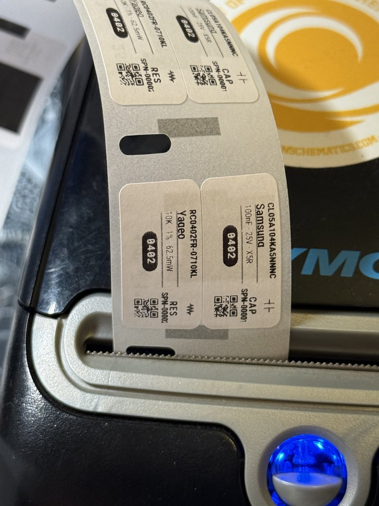
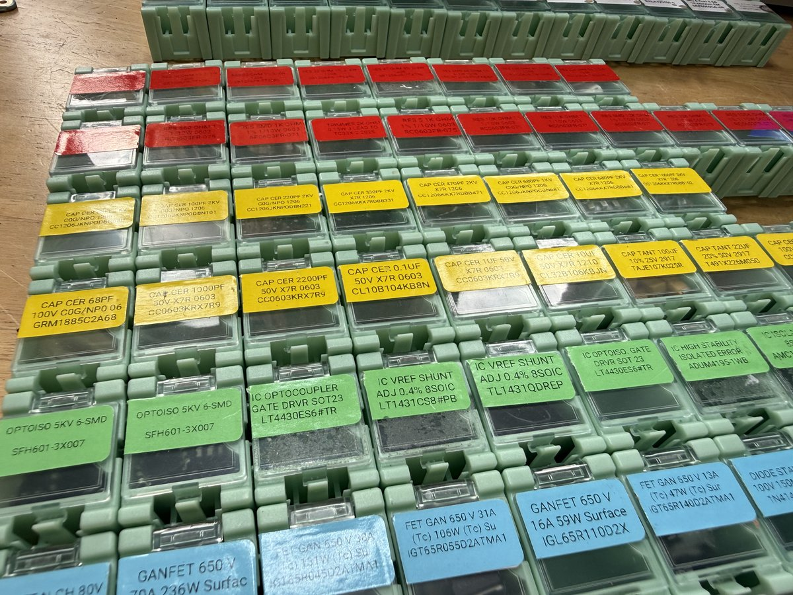
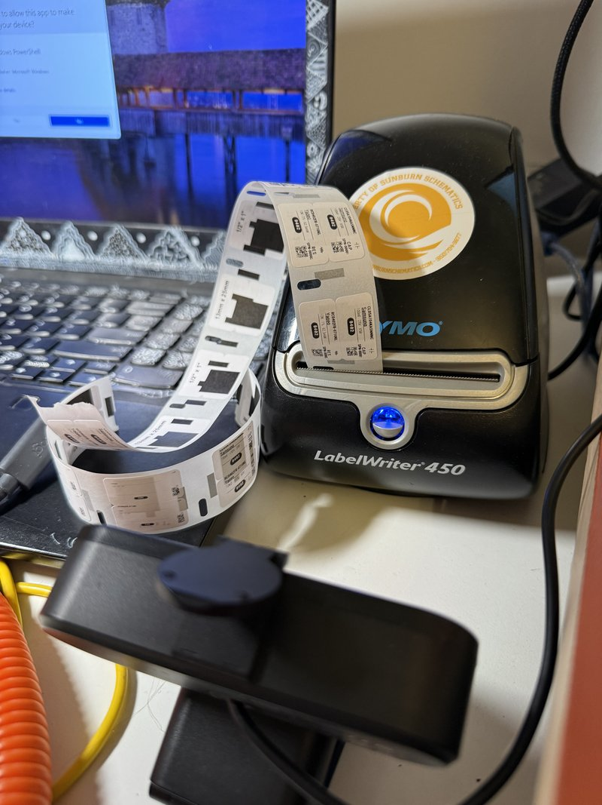

# DYMO LabelWriter Driver (No SDK Required)

Print labels on **DYMO LabelWriter** printers from Node.js on Windows — without installing DYMO Connect, DYMO Label Software, or the DYMO SDK. Includes a built-in label renderer that generates component labels with part numbers, QR codes, schematic symbols, and footprint badges.

<p align="center">
  
</p>

## Why This Exists

If you've ever prototyped with SMD components, you know the pain. You've got dozens of tiny WENTAI boxes full of 0402 capacitors, 0603 resistors, SOT-23 transistors — and they all look identical. You're squinting at faded factory labels, cross-referencing Digi-Key order sheets, and losing 10 minutes every time you need a 4.7uF cap.

The DYMO LabelWriter 450 with **30333 multipurpose labels** solves this. These tiny 1" x 1/2" labels come in a **2-up format** — two labels print side by side on each sheet. Stick one on each WENTAI box, and suddenly you can find the right component on the first try instead of the fifth.



This project gives you:
- **A clean Node.js driver** — detect and print in a few lines, no SDK required
- **A label renderer** — generates professional component labels with QR codes, schematic symbols, and footprint badges using Puppeteer
- **2-up label support** — render two labels side by side on one 30333 sheet
- **Production-tested** — we print hundreds of component labels with this at [Sunburn Schematics](https://sunburnschematics.com)

## Quick Start

### 1. Install

```bash
git clone https://github.com/Sunburn-Schematics/dymo-labelwriter-driver.git
cd dymo-labelwriter-driver
npm install
```

### 2. Detect Your Printer

```bash
node examples/detect.js
```

```
Scanning for DYMO printers...

Found 1 DYMO printer(s):

  Printer 1:
    Name:      DYMO LabelWriter 450
    Driver:    DYMO LabelWriter 450
    Port:      USB001
    Status:    Connected
```

### 3. Print Component Labels

```bash
# Preview labels as PNG files (no printer needed)
node examples/print-component-label.js --preview

# Print to your DYMO printer
node examples/print-component-label.js
```

### 4. Use in Your Own Code

```js
const { render2UpLabel, closeBrowser } = require('./label-renderer');
const { detectDymo, printImage } = require('./driver');

// Define two components
const cap = {
  mpn: 'CL05A104KA5NNNC',
  manufacturer: 'Samsung',
  sunburn_pn: '723',
  component_type: 'CAP',
  description: 'Cap 100nF 25V X5R 0402',
  package: '0402 (1005 Metric)',
  specs: { Value: '100nF', Tolerance: '±10%', 'Voltage Rating': '25V' }
};

const res = {
  mpn: 'RC0402FR-0710KL',
  manufacturer: 'Yageo',
  sunburn_pn: '707',
  component_type: 'RES',
  description: 'Res 10K 1% 1/16W 0402',
  package: '0402 (1005 Metric)',
  specs: { Value: '10kΩ', Tolerance: '±1%', 'Voltage Rating': '50V' }
};

// Render a 2-up label (returns a 294x294 PNG buffer)
const png = await render2UpLabel(cap, res);

// Print it
const { printers } = await detectDymo();
await printImage(printers[0].name, png);

// Clean up Puppeteer when done
await closeBrowser();
```

## Label Renderer

The label renderer (`label-renderer.js`) generates print-ready component labels using Puppeteer. Each label includes:

- **Part number** (MPN) — auto-sized to fit
- **Manufacturer** name
- **Description** — parsed from specs (capacitance, resistance, voltage, tolerance, etc.)
- **Footprint badge** — dark pill showing package size (0402, 0603, SOT-23, etc.)
- **Schematic symbol** — capacitor, resistor, inductor, FET, diode, IC, etc.
- **Type code** — CAP, RES, IND, FET, DIO, IC, PWR, PROT, etc.
- **Sunburn part number** (SPN) and **QR code** — scannable with any phone

### Component Data Format

```js
{
  mpn: 'CL05A104KA5NNNC',          // Manufacturer part number (required)
  manufacturer: 'Samsung',           // Manufacturer name
  sunburn_pn: '723',                 // Your internal part number (used in QR code)
  component_type: 'CAP',             // Type code (see table below)
  description: 'Cap 100nF 25V X5R',  // Fallback description
  package: '0402 (1005 Metric)',     // Package for footprint badge
  specs: {                           // Structured specs (optional, improves labels)
    Value: '100nF',
    Tolerance: '±10%',
    'Voltage Rating': '25V',
    'Temperature Coefficient': 'X5R'
  }
}
```

### Supported Component Types

| Type Code | Symbol | Description |
|-----------|--------|-------------|
| `CAP` | Capacitor | Capacitors |
| `RES` | Resistor | Resistors |
| `IND` | Inductor | Inductors |
| `FET` / `MOSFET` / `GAN` | FET | MOSFETs, GaN transistors |
| `DIO` | Diode | Diodes |
| `LED` | LED | LEDs |
| `IC` / `OPTO` / `FILT` / `SENS` | IC | ICs, optocouplers, filters, sensors |
| `PWR` | Power IC | Voltage regulators, power modules |
| `PROT` | TVS | Protection devices (TVS, ESD, fuses) |
| `XTAL` | Crystal | Crystals and oscillators |
| `CONN` | Connector | Connectors |
| `SW` | Switch | Switches, relays |
| `XFMR` | Transformer | Transformers |
| `OTHER` | Generic | Anything else |

### Rendering API

#### `render2UpLabel(item1, item2) → Promise<Buffer>`

Renders two components onto a single 30333 sheet (294x294 PNG at 300 DPI).

```js
const png = await render2UpLabel(component1, component2);
fs.writeFileSync('label.png', png);
```

#### `renderSingleLabel(item) → Promise<Buffer>`

Renders a single component label (294x147 PNG at 300 DPI).

```js
const png = await renderSingleLabel(component);
```

#### `closeBrowser() → Promise`

Closes the Puppeteer browser instance. Call this when you're done rendering.

#### `SAMPLE_COMPONENTS`

Array of 6 sample components for testing (capacitor, resistor, buck converter, TVS diode, GaN FET, signal diode).

```js
const { SAMPLE_COMPONENTS } = require('./label-renderer');
console.log(SAMPLE_COMPONENTS[0].mpn); // 'CL05A104KA5NNNC'
```

## Printer Driver

The driver (`driver.js`) handles printer detection and printing. It uses the Windows print spooler via PowerShell — no DYMO SDK needed.

### `detectDymo() → Promise`

Detects DYMO printers installed on the system via WMI.

```js
const result = await detectDymo();
// {
//   found: true,
//   printers: [{
//     name: 'DYMO LabelWriter 450',
//     driver: 'DYMO LabelWriter 450',
//     port: 'USB001',
//     status: 0,
//     offline: false,
//     connected: true
//   }]
// }
```

### `printImage(printerName, imageBuffer) → Promise`

Prints an image buffer to the specified DYMO printer.

```js
const result = await printImage('DYMO LabelWriter 450', pngBuffer);
// { success: true }
// or { success: false, error: 'Print failed: ...' }
```

| Parameter | Type | Description |
|-----------|------|-------------|
| `printerName` | string | Printer name from `detectDymo()` |
| `imageBuffer` | Buffer | PNG, BMP, or JPEG image data |

### `LABEL_SPECS`

Dimensions for common DYMO label types. Use these to size your images correctly.

```js
const { LABEL_SPECS } = require('./driver');
const spec = LABEL_SPECS['30333'];
// { name: '30333 Multipurpose 2-Up', labelWidth: 0.98, labelHeight: 0.49, twoUp: true, ... }
```

## Hardware Setup

### Prerequisites

- **Windows** (uses WMI and Windows print spooler)
- **Node.js** 14+
- **DYMO printer driver** — comes via Windows Update or from [dymo.com/support](https://www.dymo.com/support)
- **DYMO Connect / DYMO Label software NOT required**

The printer just needs to show up in Windows **Settings > Printers & Scanners**. That's it.

### Printer Preferences

For correct label sizing, set the DYMO printer's default paper size in Windows:

1. Open **Settings > Printers & Scanners > DYMO LabelWriter 450 > Printing Preferences**
2. Set **Paper Size** to "30333 Multipurpose - 2 Up" (or whichever label you're using)
3. Set **Orientation** to match your label layout
4. Set **Quality** to "Text & Graphics" for component labels

### Compatible Printers

Tested with: **DYMO LabelWriter 450**

Should work with any LabelWriter that registers as a Windows printer: LabelWriter 450, 550, 4XL, 5XL, etc.

## The 30333 "2-Up" Format

The DYMO 30333 is the label we use most for component labeling. The physical sheet is 1" x 1" and holds **two labels side by side.**

```
┌─────────────────────────┐
│  ┌──────────┬──────────┐ │
│  │          │          │ │
│  │  Label 1 │  Label 2 │ │  ← One physical sheet (1" x 1")
│  │ 0.49" x  │ 0.49" x  │ │
│  │  0.98"   │  0.98"   │ │
│  │          │          │ │
│  └──────────┴──────────┘ │
└─────────────────────────┘
        Feed direction →
```

| Measurement | Inches | Pixels @300 DPI |
|-------------|--------|-----------------|
| Individual label | 0.98" x 0.49" | 294 x 147 |
| Full sheet (2-up) | 0.98" x 0.98" | 294 x 294 |

### Supported Label Sizes

| Model | Size | Type | Notes |
|-------|------|------|-------|
| **30333** | 1" x 1/2" | Multipurpose, **2-up** | Two labels per sheet — ideal for small component boxes |
| 30330 | 3/4" x 2" | Return address | |
| 30332 | 1" x 2-1/8" | Multipurpose | |
| 30252 | 1-1/8" x 3-1/2" | Address | Standard mailing label |
| 30256 | 2-5/16" x 4" | Shipping | Large shipping label |

## Project Structure

```
dymo-labelwriter-driver/
├── driver.js              # Printer detection + printing (no dependencies)
├── label-renderer.js      # Component label renderer (requires puppeteer)
├── package.json
├── examples/
│   ├── detect.js                  # Find DYMO printers
│   ├── print-single.js            # Print any image file
│   ├── print-2up.js               # Print basic 2-up test image
│   └── print-component-label.js   # Print component labels with full layout
├── docs/
│   ├── label-photo.jpg            # Photo of printed labels
│   └── label-specs.md             # Detailed label dimensions
└── images/
    └── printer-1.jpg              # Color-coded component boxes
```

## Why Not the DYMO SDK?

| | DYMO SDK | This Driver |
|---|---------|-------------|
| Install size | ~200MB+ (DYMO Connect) | Zero — uses Windows built-in |
| Dependencies | .NET Framework, COM objects | Node.js + Puppeteer |
| Label design | XML-based label format | Send any image |
| Complexity | 500+ API calls | 2 functions: `detect()` and `print()` |
| Works without DYMO software | No | Yes — just needs the printer driver |

## How This Was Built: AI + Webcam Feedback Loop

The label layout in this repo was designed and iteratively refined by [Claude Code](https://claude.com/claude-code) (Anthropic's AI coding agent) with a physical feedback loop — a webcam pointed at the label printer's output tray.

<p align="center">
  
</p>

Here's how it worked:

1. **Claude renders a label** — generates the HTML layout, runs Puppeteer to produce a 294x294 PNG
2. **Claude prints the label** — sends the PNG to the DYMO printer via the Windows print spooler
3. **Claude captures a photo** — uses `ffmpeg` to grab a frame from a 4K webcam (EMEET SmartCam C960) pointed at the printer output
4. **Claude analyzes the result** — reads the webcam image to check if text is clipped, margins are off, QR codes are visible, etc.
5. **Claude adjusts and repeats** — modifies margins, font sizes, layout proportions, then prints again

This closed-loop process let Claude autonomously iterate on the label design — adjusting print margins by hundredths of an inch, fixing clipped text, repositioning footprint badges, and verifying QR codes were scannable (using `pyzbar` for QR decoding and OpenCV for image analysis). The human just had to say "the part number is getting cut off" or "move the badge down" and Claude could see the physical result of each change.

The webcam setup is simple: any USB webcam clamped or placed near the printer's output slot. Claude accesses it via `ffmpeg -f dshow` on Windows. No special software needed.

## Credits

Built by **[Sunburn Schematics](https://sunburnschematics.com)** for production use in our electronics lab. Label layout designed and refined with [Claude Code](https://claude.com/claude-code).

## License

PolyForm Noncommercial License 1.0.0 — free for noncommercial use. See [LICENSE](LICENSE) for details. For commercial licensing, contact danny@sunburnschematics.com.
